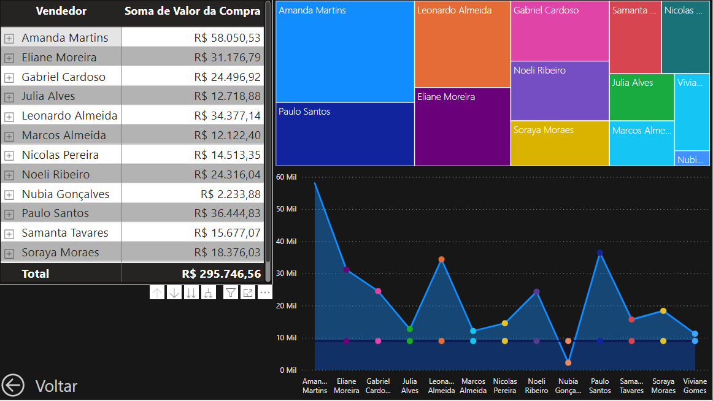

# Loja ABC

Descrição: Com base no projeto realizado no curso de Excel e PowerBI, ministrado por Clevison Santos na plataforma da . Fiz um dashboard de vendas da loja ficticia ABC, onde tive como princípal objetivo, treinar a adquirir novas habilidades.

## Tela Princípal

- Está é a Home Page do Dashboard, onde o usuário pode escolher qual relátório ele irá ver através dos ícones da tela. Basta clicar e será direcionado a página desejada.

## Tela Vendas

- Na tela de vendas, logo acima teremos um scroller com o nome e valor total das vendas feitas por um funcionário, logo abaixo temos uma tabela com imagens, nome do produto, quantidade vendidas e valor da compra. Para chegar nesses valores fiz medidas para cada caso, as mesmas medidas se aplicam aos cartões ao lado com valores de Previsão de Receita, Total Vendido e % Alcançada com base em uma meta pré-estabelecida, R$9000,00 para cada vendedor.

## Tela Funcionários

- Na tela de funcionários, temos gráficos para apontar o desempenho de cada colaborador com base em suas vendas. O gráfico treemap, representa por meio do tamanho dos quadrados o quão bem o vendedor foi, a primeira vista percebemos que os vendedores, Amanda Martins, Paulo Santos, Leonardo Almeida e Eliane Moreira, obtiveram os melhores desempenhos.
O gráfico de área, mostra a meta estabelecida para cada colaborador (Linha azul marinho) e o desempenho com base nas vendas, neste caso temos um contraste entre Amanda, que teve o melhor desempenho e Nubia, que teve o pior, estando até mesmo de baixo da meta.
E por fim, temos uma matriz onde mostra o valor total vendido e os produtos que o funcionário vendeu.

## Tela Clientes

- Na tela de clientes, temos gráficos com as informações dos produtos mais vendidos, quais estados tiveram maior média de vendas e uma tabela com os clientes que mais compraram em nossa loja.

## Tela Estoque

- Por fim, temos a tela de estoque. Onde na tabela mostra o produto, quantidade inicial, quantidade vendida e quantidade final, também adicionamos ícones ao lado da quantidade final utilizando a formatação condicional. Produtos com mais de 30 unidades estão em verde, produtos entre 30 a 10 unidades estão em amarelo e produtos com menos de 10 unidades estão em vermelho.
Ao lado temos um gráfico que aponta, quais produtos mais saem no estoque, com base na medida de quantidade vendida.

## Considerações finais

- Minhas maiores dificuldades no projeto, foi criar um estilo agradável e intuitivo, preciso me aprofundar em design.
- Fora o design, esse projeto trouxe bastante aplicações na área das medidas, onde pude treinar e ganhar mais confiança com as formulas.

.