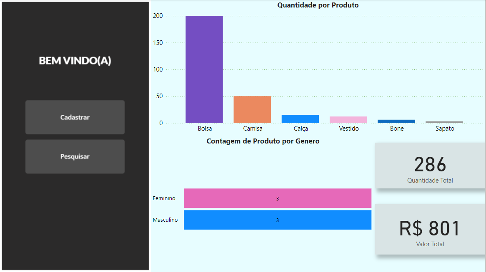
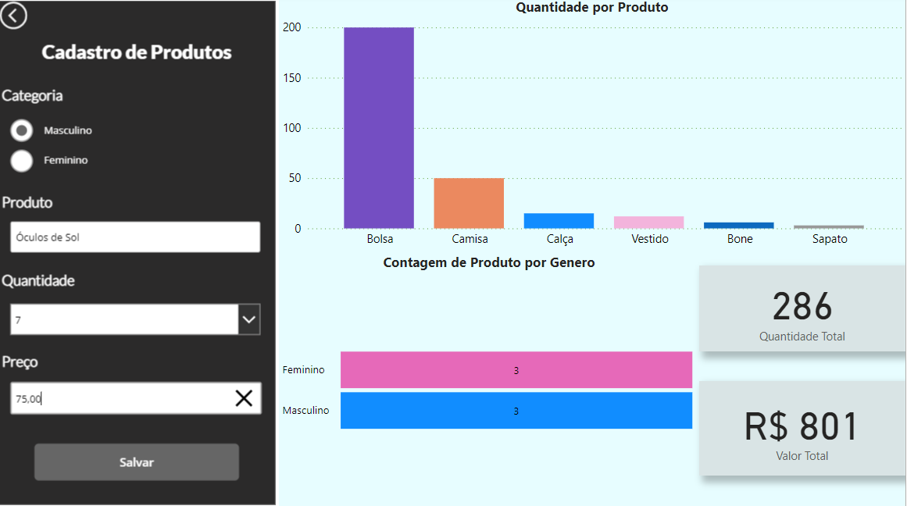
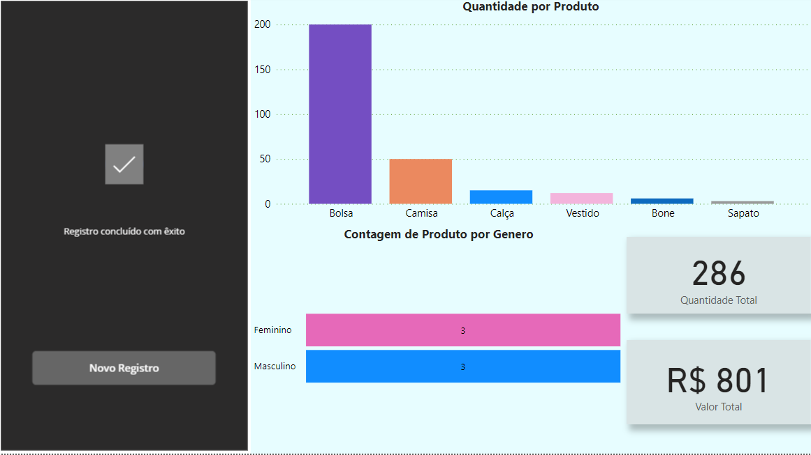
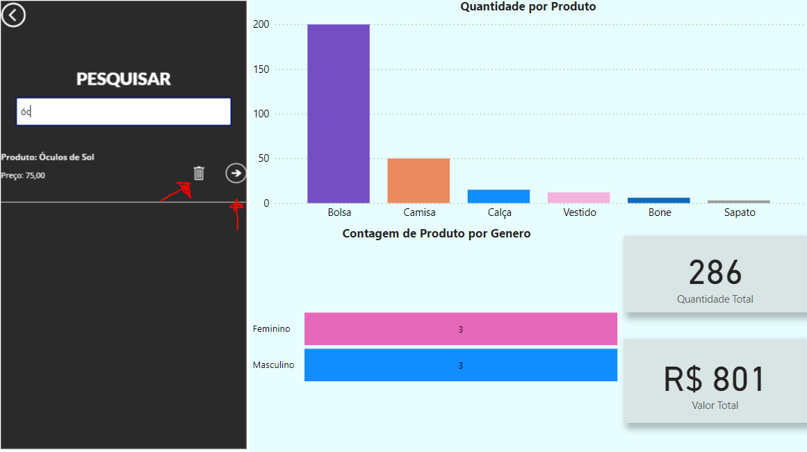
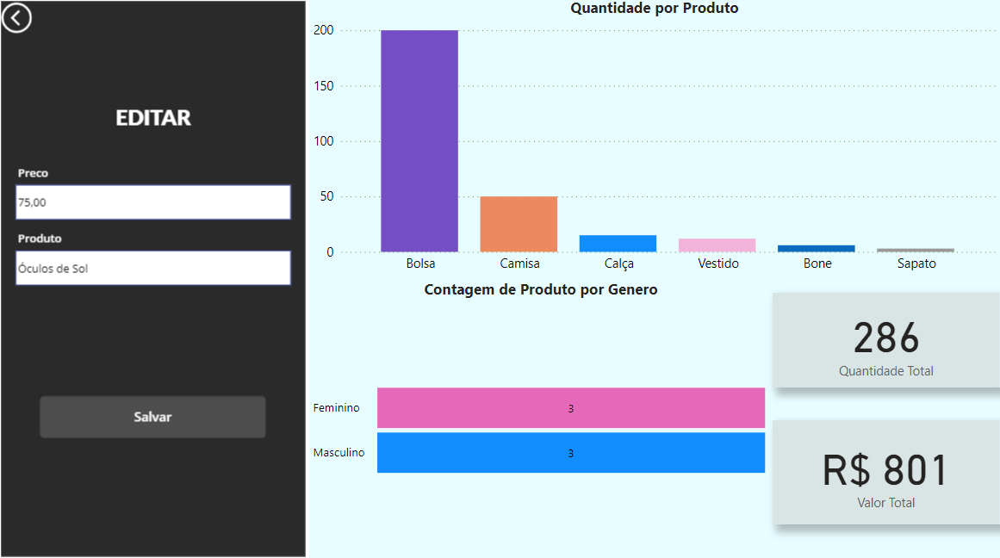
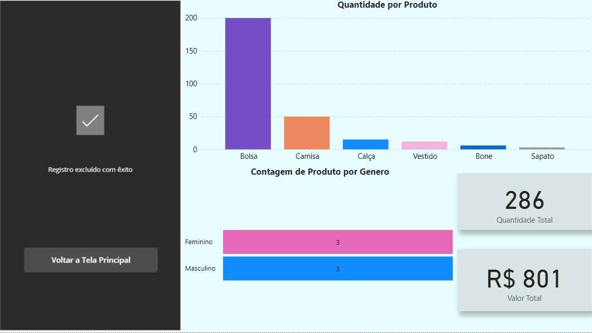

# Integração do PowerApps com PowerBI

Descrição: Com base no projeto realizado no curso de Excel e PowerBI, ministrado por Clevison Santos na plataforma da . Fiz a integração de um App criado no , juntamente com o . A fim de cadastrar produtos e controlar o estoque.

### Tela princípal

Ao entrarmos no Dashboard temos acesso diretamente ao App com as opções de cadastar ou pesquisar produtos, gráficos e cartões onde temos um controle do valor total do estoque, quantos produtos temos, controle de produtos por sexo e quantidade por produto.

### Cadastro de Produtos

Aqui vemos que podemos cadastrar produtos preenchendo as seguintes opções: Categoria -> Sexo Masculino ou Feminino; Produto -> Nome do Produto...; Quantidade -> Quantidade disponível em estoque; Preço -> Valor do produto, ao preencher todos os campos é só clicar no botão de salvar e feito.

### Pesquisar produtos

Clicando no botão de PESQUISAR, podemos filtrar o produto procurado através da barra de pesuisa, e ter a opção de excluir o registro (Botão de Lixeira) ou editar o preço (Botão de Seta).

