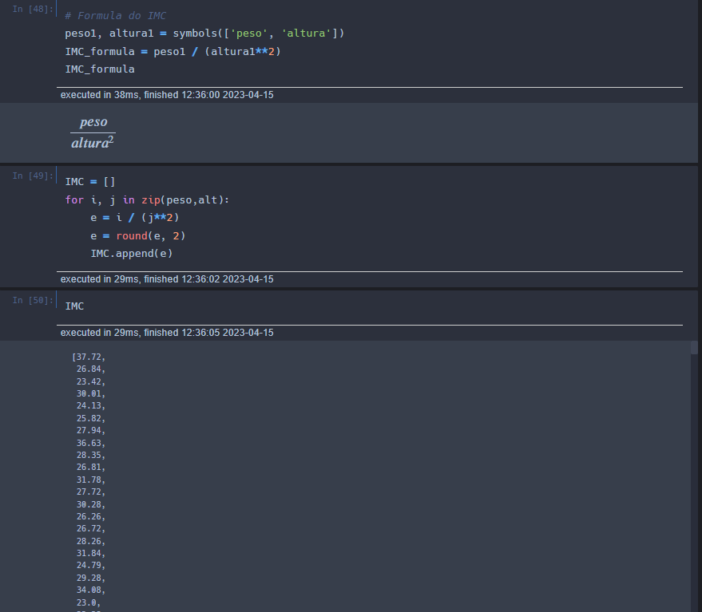

# Análise de tendencia para problemas cardíacos

Descrição: Com base no curso [Formação livre em ciência de dados] ministrado por João Pedro dos Passos Pereira, venho expor essa análise com base no meu ponto de vista.

## Pacotes utilizados:

Pandas
Numpy
Sympy

## Objetivo

Verificar através da geração de dados aleatórios, a tendência de problemas cardíacos em uma amostra da população.

1. Como primeiro passo importamos os pacotes necessários, definimos o tamanho da amostra (neste caso 2000), geramos dados aleatórios através do pacote numpy e convertemos para lista.
   

2. Segundo passo é gerar o peso com base nas alturas obtidas na amostra acima, note que guardamos os valores para peso na variável **peso** que recebe um array.
   

3. No terceiro passo utilizamos os dados obtidos de altura e peso para calcular o IMC e guardar no devido array.
   

4. Agora no quarto passo, geramos os sexos para cada dado gerado na amostra, utilizando a estrutura _for_ e armazenando no array de **sexo**.
   

5. Quinto passo geramos a correspondencia de problema cardiaco, na qual: se o IMC é maior que 40, então colocamos 'S' para 'SIM'; Se o IMC é maior que 30 e menor que quarenta, colocamos 'P' para 'PARCIAL'; Caso seja abaixo de 30, então colocamos 'N' para 'NÃO'. Por fim armazenamos os resultados no array **cardiiaco**.
   

6. Agora com todos dados obtidos, armazenamos todas as variáveis dentro de uma só (**data**), criamos um DataFrame a partir da mesma e mostramos os resultados em forma de tabela.
   

7. Geramos as médias entre PESO, ALTURA E IMC
   

8. Por fim geramos as frequências com base nos dados.
   
   Coincidentemente obtivemos dados relativamente parecidados com os apontados pelo , segundo o Instituto Brasileiro de Geografia e Estatistica no ano de 2021, o percentual de homens era: 48,9% e de mulheres era: 51,1%. Já nos dados obtidos aleatóriamente, tivemos uma média maior de homens, sendo ela de 50.1% sexo masculino e 49.9% sexo feminino.

### Conclusão

Concluimos que a maior parte da amostra obtida, cerca de 59.1% não tem tendência a problemas cardíacos. Já 35.3% tem tendência a ter problemas cardíacos e apenas 5.6% realmente tem problemas cardíacos. Mas como medida de prevenção, podemos criar propagandas e programas que estimulem o cuidado com a saúde, pois assim evitaremos que os 35.3% da população que tem tendência a ter problemas cardíacos, componham e elevem os 5.6% da população.
